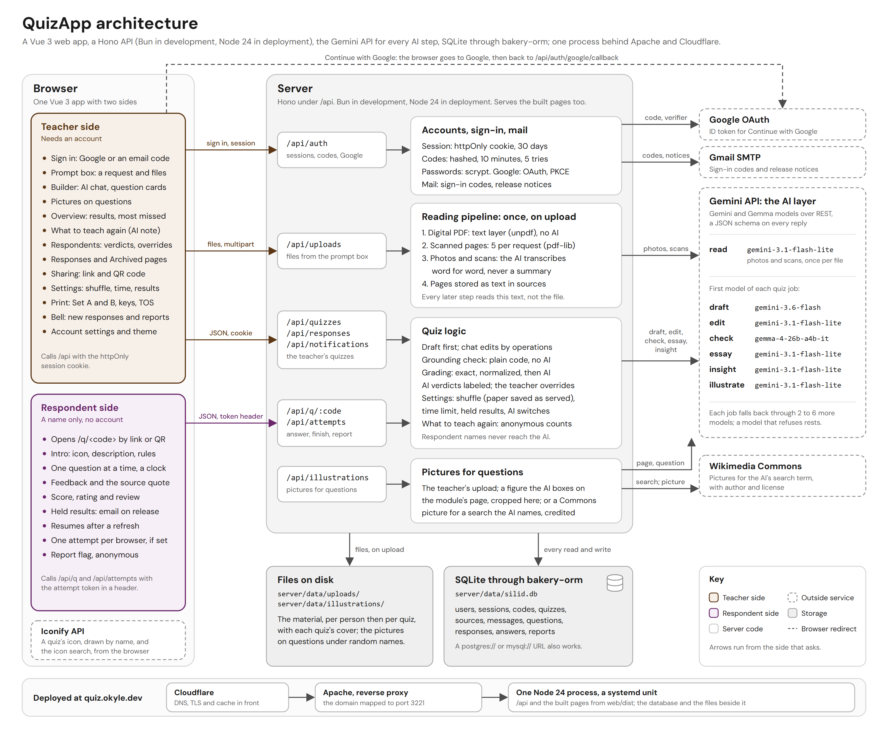

# QuizApp

QuizApp turns a teacher's own material into a quiz. A teacher drops a module (a PDF, or photos of a handout) into a prompt box and says what is wanted. The AI drafts the quiz at once, and a chat refines it. Every question cites the sentence of the material it comes from, and a grounding check written in plain code marks a quote "not found" when that sentence is not in the file. Quizzes are shared by link or QR code, and people answer with a name and no account.

It is an open platform with no classes: anyone can make a quiz, and anyone with the link can answer it.

QuizApp is BPC Competitors' entry to the RAITE 2026 AI in Education Hackathon (PSITE Central Luzon, sponsored by LIVRO).

- Live: [quiz.okyle.dev](https://quiz.okyle.dev)
- Architecture diagram: [docs/architecture.png](docs/architecture.png)
- Technical documentation: [docs/DOCUMENTATION.md](docs/DOCUMENTATION.md)

## Features

### Making a quiz

- **Draft first, chat refines.** The prompt box takes a request ("15 questions, mixed kinds, Grade 7") and PDFs or photos. The quiz opens with a full draft about 20 s later, and chat messages change it from there ("make question 4 harder and add two true or false"). While the draft is written, the questions pane builds skeleton cards under the name of the phase ("Reading the module", "Writing the questions", "Checking each quote against the file"), and the prompt box wears a turning gradient ring with colored shadows; at rest it has a neutral outline. Each reply from the AI is revealed word by word as it lands.
- **Four kinds of question:** multiple choice, true or false, identification and essay. Each question carries an explanation shown after answering, a topic taken from the material's headings, a Bloom level and its points. Each option of a multiple-choice or true-or-false question says why it is right or wrong.
- **Every question shows its source.** The supporting sentence sits under the question with its file and page ("Found in science7-metals.pdf, page 1"). A sentence that is not in the material is marked "Not found in the file", so it can be fixed before the quiz is shared.
- **Hand editing.** Every field of every question can be changed, and questions can be added, moved and deleted. Each save checks every quote again. A save or a chat edit keeps each question's row, so the answers people have already given stay with their questions; deleting a question deletes its answers, and the editor says how many people have answered.
- **Pictures on questions.** A question can carry a picture: the teacher's own upload (JPG, PNG or WebP, 5 MB at most), a figure the AI boxes on the module's page and the server crops out, or a Wikimedia Commons picture for a search term the AI names, stored with its author and license. The picture shows above the question on the take screen and prints in grayscale with its credit.
- **Sharing.** A quiz stays a draft until it is shared. Sharing gives a link and a QR code (downloadable as SVG). Stopping turns the link off and pauses the clock of every attempt still open on an overall time limit; sharing again brings back the same link and resumes those clocks where they stopped. The overview marks the quiz "Shared", "Not shared" (shared before: it has takers, open attempts or a release) or "Draft".
- **Practice, Test or Graded.** Three options on the Sharing page that set four settings at once. Practice, the default, checks each answer when it is confirmed, with the correct answer, the explanation and the source sentence, and locks it; hints are on and the quiz can be taken again. Test saves answers unchecked and lets them change until the quiz is finished, then shows the score and the answers; hints are off and the quiz can be taken again. Graded is Test with the scores and answers held until the quiz maker releases them, and one attempt per browser. When the four settings match none of the three, the control reads "Custom". The overview's Sharing panel states the mode in a sentence, with a Change link.
- **Quiz settings.** A name and a description; an icon from any Iconify set, or an uploaded cover (JPG, PNG, WebP or GIF, 5 MB at most; the page shrinks a photo to 1600 px of WebP before sending it); a color for the quiz's card, its square in the sidebar and its page for respondents (six palette colors or any picked one, with the text on it chosen by contrast); shuffled questions and shuffled options; a time limit per question (10 s to 10 min) or for the whole quiz (1 min to 3 h); a hint on each question naming the topic and page, or none; one attempt per browser, or more than one; and whether the score and the answers show at the end or wait until the quiz maker releases them. AI checking of typed answers and AI scoring of essays each have a switch. Every control saves as it changes.
- **Held results.** With "Show score and answers" off, a respondent who finishes sees "Your answers are in" and can leave an email address. "Release results", on the overview or the settings page, shows the scores from then on and emails everyone who asked, each address once.
- **Shuffled papers are reviewed as served.** An attempt's question order, option order and answer key are saved with it when it starts, so a response opens in the order the respondent saw, with the letters the respondent saw ("Key B").
- **Results.** Views, quiz takers, the average and highest score, responses per day over 14 days, the questions missed most often, and an AI note on what to teach again, written from anonymous counts. The note names the questions by number with their miss counts ("Q5 (9 of 12 missed)"), says how many finished, and speaks of the class in the third person; under five finished, it opens by saying that is too few to show a pattern. The recent respondents carry a Download CSV button.
- **Respondents, sections and a CSV.** The Respondents page lists every attempt with its name and section, sorted by newest, name, score high to low or score low to high, found by name, and narrowed to one section. Download CSV writes every response for a spreadsheet: Name, Section, Score, Total, Percent, Status, Started, Finished, a column per question with the points that answer earned (its prompt, cut to 60 characters, on a second header row) and Rating, in UTF-8 with a byte order mark so Excel reads the accents.
- **Score changes.** Each response opens with every answer and its verdict. An AI verdict is labeled as one, and the quiz maker can change the score of any typed answer, or delete the response. An essay the AI did not score waits for the quiz maker's score and counts as 0 until it is given; the overview counts those and links to the oldest.
- **Responses, Archived and the home list.** The sidebar's Responses page lists every response across every quiz, people still answering first, each with its section and its quiz, and finds one by name or quiz. Archived lists the archived quizzes, each with Restore. On the home list every card reads its question count and its finished responses ("11 questions · 12 responses") and wears a small square that draws those responses per day over the last 14 days.
- **Reports.** Respondents can flag a quiz (a wrong answer, harmful content, copied work, or something else). A report made while a question is on screen names that question. Reports carry no name and show on the quiz's overview.
- **Notifications.** A bell in the top bar lists finished responses and new reports on the quiz maker's quizzes, with a dot while any are unread.
- **Print as a test.** A black-and-white paper test: Set A in the quiz's order and a shuffled Set B, an answer key for each set, and a table of specifications by topic and Bloom level. Short bond, long bond or A4. A question's picture prints in grayscale, no taller than a third of the page, with its credit under it.
- **Duplicate, archive, delete.** A copy keeps the questions, files, settings and cover and starts with no responses. An archived quiz moves to the Archived page and its link stops opening; its Sharing section reads "Archived. The link does not open." Archiving a shared quiz pauses the clocks of its open attempts as stopping does, and Restore resumes them. Deleting removes the quiz, its files and its responses. Each of these, with Share, Stop sharing and the builder's Save, confirms itself with one line at the bottom of the screen for 3 s.
- **Account settings.** The name shown to respondents, the ways to sign in (a code by email, Google, a password), a light, dark or system theme, signing out every other device, and deleting the account with everything in it.

### Answering a quiz

- The link or the QR code opens the quiz. The intro shows the quiz's icon or cover, its description, and its rules: a time limit, answers that can be changed until the quiz is finished, one attempt per browser, held results, essays scored by hand. A name is all it asks for; a section ("7 Sampaguita") is optional, and the quiz maker sees it beside the name.
- One question at a time, with a progress bar and, when the quiz offers hints, a hint naming the topic and page to look at. A tap or typed text is a pick, never an answer: the filled button under the question confirms it, Check on a Practice quiz and Next on a Test or Graded one. Skip is the quiet button while the question is open; on a Test or Graded quiz it drops a pick that was not confirmed.
- On a Practice quiz, Check brings the feedback and locks the answer: the right option, why each option is right or wrong, the explanation, and the sentence of the material the answer comes from. Next then moves on.
- On a Test or Graded quiz, Next saves the answer and nothing comes back about how it scored. A saved answer can be changed until Finish, and a "Your answers" list comes before Finish: every question marked "Answered" or "Not answered", each row the way back to it, and the count still unanswered above the button. A Test shows the score and every question's feedback at the end; a Graded quiz holds them until the quiz maker releases them.
- A timed quiz shows a clock in the top bar: per question, the quiz moves on at zero and a passed question cannot be opened again, so there is no way back and no list; overall, the quiz finishes on its own at zero. At zero the pick on screen is sent first.
- A score at the end, a rating from five faces, a review of every question, and, when the quiz allows it, "Take the quiz again", which starts with empty name and section fields. An essay waiting for the quiz maker's score says so. With the results held, the end says "Your answers are in" and takes an email address to write to when they are released.
- A refresh or a closed tab resumes at the first unanswered question. With one attempt per browser, a browser that finished the quiz opens it as "Quiz already taken".
- A flag on every page, drawn in the muted ink, reports the quiz to its maker; it turns red once a report is sent.
- Motion marks what changed and nothing else: an option presses in, the pick fills and the correct answer follows it, the reasons and the source sentence rise in order, the next question arrives as the last one leaves, the score counts up. When the system asks for reduced motion, every state appears at once.

### English and Filipino

The AI writes in the language the request asks for, or else in the material's. A Filipino true-or-false question answers Tama or Mali, identification accepts Filipino number words (wala to sampu), and a Filipino quiz prints with Filipino headings, directions and Bloom levels.

## How the AI is used

There are seven AI jobs, each with its own chain of models through the Gemini API. Every call asks for JSON that matches a schema, so a reply is parsed rather than scraped out of prose.

| Job | What it does | First model | Why that model |
| --- | --- | --- | --- |
| read | Transcribes photos and scanned pages, once per file | `gemini-3.1-flash-lite` | Reads print well, and its tier allows 500 requests a day |
| draft | Writes the whole quiz from the material and the request | `gemini-3.6-flash` | Quality shows most here, so drafts get the full Flash models; each allows 20 requests a day, so the chain falls back through other Flash models |
| edit | Turns a chat message into operations on the quiz | `gemini-3.1-flash-lite` | Frequent and small; 5 to 6.4 s per edit |
| check | Judges a typed identification answer that plain matching did not accept | `gemma-4-26b-a4b-it` | Runs once per near-miss answer, so it needs the most quota; Gemma 4 allows 14,400 requests a day |
| essay | Scores an essay against its rubric, with feedback | `gemini-3.1-flash-lite` | One call per essay; 500 requests a day |
| insight | Writes what to teach again | `gemini-3.1-flash-lite` | One call per request for the note; 500 requests a day |
| illustrate | Boxes a figure on the module's page and names a search term for Wikimedia Commons | `gemini-3.1-flash-lite` | One call per question asked about, on the same models that read pages |

The quotas are the free tier's limits for this project's key on 2026-10-01. A model that refuses (overloaded, rate-limited, or out of its daily quota) rests, and the next model in the chain answers; [the documentation](docs/DOCUMENTATION.md#model-chains-and-resting) has the full chains and the rest rules.

No picture is generated. Gemini's image models answered 429 on the free tier on the first request to each of them, so a picture comes from the teacher, from the module's own page, or from Wikimedia Commons.

### Keeping the AI honest

- **The grounding check is plain code.** Whether a quote is in the material does not depend on the AI. The check normalizes both texts and looks for the quote as it is, or for 85% of its words in order in one place. A question whose quote is missing is marked "Not found in the file".
- **No summaries.** Each file is read once, on upload: a digital PDF from its text layer with no AI, and photos and scanned pages transcribed word for word by the AI. Every later AI step uses only that stored text. A summary would lose the sentences that the questions quote, so there is none.
- **Plain code first.** Multiple choice and true or false are graded exactly. Identification is matched by plain normalization first (case, spacing, punctuation, English and Filipino number words), and only a near miss goes to the AI.
- **AI verdicts are labeled.** A verdict the AI gave carries an "AI" label for the respondent and for the quiz maker, with a notice that AI verdicts can be wrong. The quiz maker can change any typed answer's score, and the change is marked.
- **Failures show.** When the AI cannot check an identification answer, the plain verdict stands and says the AI did not look. When it cannot score an essay, the essay gets 0 and a note that the quiz maker will score it.
- **The AI can be switched off per quiz.** With "Check typed answers with AI" off, an identification answer counts only on an exact match after normalizing. With "Score essays with AI" off, no essay goes to the AI; each waits for the quiz maker's score and counts as 0 until it is given.
- **Anonymous counts.** The note on what to teach again is written from per-question counts, never names, and cites the questions it rests on by number with their miss counts, so each claim can be checked against the table beside it. No respondent's name is ever sent to the AI.
- **Reports reach the quiz maker.** A respondent's flag lands on the quiz's overview.

## Measured on this build

Measured on 2026-10-01, the last line on 2026-10-02:

- A draft of 10 to 12 questions takes 17 to 21 s, and 9 to 12 of its quotes are found in the material.
- A draft from a PDF plus a photo took 17.2 s and found 8 of 8 quotes.
- A chat edit on `gemini-3.1-flash-lite` takes 5 to 6.4 s.
- A multiple-choice answer is graded in 5 to 11 ms on the server.
- An identification check that needs the AI has a median of 3.1 s; each model gets 8 s before the next is tried.
- An essay is scored in 3 to 7.5 s.
- A digital PDF is read in about 0.5 s, a photo in 6.7 s, and a 21-page scanned PDF in 33 s.
- Stopping sharing for 4 s cost an open attempt's overall clock 33 ms.

## Tech stack

| Part | Built with |
| --- | --- |
| Web app | Vue 3.5, Vite 8, vue-router 5, TypeScript 5.9.3 (checked with vue-tsc). DM Sans and Google Sans Flex bundled; Material Symbols Rounded through `@iconify/vue` as an offline subset; a quiz's own icon from any Iconify set, which the browser fetches from api.iconify.design by name; QR codes drawn in the browser by `uqr`. |
| API | Hono 4. Bun runs it in development and Node 24 in deployment (through `@hono/node-server`), from the same TypeScript files with no build step; the live server reports `node v24.21.0`. Deployed, the same process also serves the built pages. |
| Reading files | `unpdf` for a PDF's text layer and to draw a page as a picture, `pdf-lib` to split scanned pages into batches for the AI, `@napi-rs/canvas` to crop a figure out of the drawn page. |
| Pictures | Wikimedia Commons and English Wikipedia through their public APIs, for a picture search; a chosen file is copied from upload.wikimedia.org and kept with its author and license. |
| AI | The Gemini API over REST with `fetch`: Gemini and Gemma models, structured JSON output. |
| Database | SQLite through `bakery-orm`, the ORM from Bakery (Kyle's web framework), vendored in `bakery-orm/`. It talks to Bun's own SQL client on Bun and to `node:sqlite` on Node. A `postgres://` or `mysql://` URL moves the same code to those databases. |
| Mail | `nodemailer` over Gmail SMTP, for sign-in codes and the notice that held results are out. |
| Sign-in | Emailed six-digit codes, Google OAuth (authorization code with PKCE) and passwords hashed with scrypt, all ending in one httpOnly session cookie. |

## Architecture



- **Browser.** One Vue app with two sides. The teacher side (brown) needs an account. The respondent side (purple, at `/q/<code>`) needs a name only, and holds its attempt with a token sent in a header.
- **API.** One Hono app under `/api`: `/auth`, `/uploads`, `/quizzes`, `/responses`, `/notifications`, `/illustrations`, and the public `/q/:code` and `/attempts`. Every error leaves as JSON with a message written for people.
- **Reading pipeline.** A file is read the moment it is uploaded, before the prompt is sent. Its pages are stored as text, and every later step reads that text.
- **Quiz logic.** Drafting, chat edits by operations, the grounding check, grading, the settings a quiz applies to its respondents (shuffling, with each paper saved as served; time limits, paused while the link is closed; answers checked one by one or at the end; held results; hints; the AI switches), the note on what to teach again, and the responses as a CSV.
- **Pictures.** A figure boxed by the AI on the module's page and cropped by the server, or a Wikimedia Commons picture for a search term the AI names, copied and credited.
- **AI layer.** One client for the Gemini API, with a chain of models per job and a rest list for models that refuse.
- **Storage.** One SQLite file through bakery-orm; the uploaded files and each quiz's cover under `server/data/uploads`; the pictures on questions under `server/data/illustrations`.
- **Outside services.** The Gemini API, Google OAuth for "Continue with Google", Gmail SMTP for sign-in codes and release notices, Wikimedia Commons for pictures, and Iconify's API, which the browser asks for a quiz's icon.
- **Deployed.** One Node 24 process answers `/api` and serves the built pages from `web/dist`, behind Apache as a reverse proxy and Cloudflare in front of it, at https://quiz.okyle.dev.

In development, Vite (port 3220) forwards `/api` to the server (port 3221), so the app calls its own origin exactly as it does when deployed.

## Running it

Needs [Bun](https://bun.sh) 1.4 or later and a Gemini API key from [aistudio.google.com](https://aistudio.google.com). Google sign-in and emailed codes are optional in development.

### Development

The server, on port 3221:

```bash
cd server
bun install
cp .env.example .env     # then fill in GEMINI_API_KEY, at least
bun run db:sync          # creates the tables from schema.ts
bun run dev              # restarts on every change
```

The web app, on port 3220, in a second terminal:

```bash
cd web
bun install
bun run dev
```

Open http://localhost:3220 and sign in once with "Continue with email". Without `MAIL_USER` and `MAIL_APP_PASSWORD`, the six-digit code prints in the server's log. "Continue with Google" needs `GOOGLE_CLIENT_ID` and `GOOGLE_CLIENT_SECRET`, with `http://localhost:3220/api/auth/google/callback` as an authorized redirect URI.

Then add the sample quizzes to that account. The seed needs the account to exist, which is why it runs after the first sign-in:

```bash
cd server
bun run seed <the email used to sign in>
```

`http://localhost:3221/api/health` answers with the runtime and the number of quizzes.

### Production

Live at https://quiz.okyle.dev. The server runs on Node 24 (its package asks for Node 22.22 or later; the box has 24.21). Node strips the TypeScript types itself, so the server has no build step; the ORM and the web app do. The one process serves the built pages from `web/dist` itself (`STATIC_DIR` points it elsewhere): hashed assets with a year's cache, `index.html` fetched fresh, and any path that is no file answered with `index.html`, so the app's real paths such as `/app/quiz/12` open. Apache in front maps the domain to port 3221 as a reverse proxy, and Cloudflare sits in front of Apache. A systemd unit keeps the process up. Bun is on the box too, for installing the server's packages and syncing the schema; it does not run the server.

1. Build the ORM for Node, before every deploy. Its package points Node at the compiled `dist/`, which is not checked in, while Bun reads `src/`.
   ```bash
   cd bakery-orm && bun install && bun run build
   ```
2. Build the web app into `web/dist` (type check, then the Vite build).
   ```bash
   cd web && bun install && bun run build
   ```
3. Copy `server/`, `bakery-orm/` with its `dist/`, and `web/dist` to the box, without `node_modules`, `server/data` and `server/.env`, and install the server's packages there.
   ```bash
   cd server && bun install --production
   ```
4. Fill in `server/.env` on the box: the development settings plus `NODE_ENV=production`, `PUBLIC_URL` and `PORT=3221`. Then create the tables.
   ```bash
   bun run db:sync
   ```
5. Run `node --env-file=.env src/index.ts` in `server/` as a service, with `STATIC_DIR` set to the copy of `web/dist`. The unit restarts the process 3 s after it stops and caps it at 450 MB.
6. Put the reverse proxy in front over HTTPS, passing `X-Forwarded-For`.

A deploy script kept beside the repository does this over SSH: it builds the ORM and the pages, ships the code, installs the packages and, on every run once the box has a database, syncs the box's schema (`bun run db:sync`), since a code-only deploy used to leave new columns missing there; with `--setup` it also writes the `.env`, the unit and the proxy's routing line; with `--data` it stops the service, copies the SQLite file with `VACUUM INTO` (a WAL database's newest pages sit in its `-wal` file, so a plain copy would miss them) together with the uploads and illustrations, and syncs the schema. It ends by restarting the service and reading `/api/health` on the box and through the domain; the live reply names the runtime, `node v24.21.0`.

Bun can run the same files in production too (`bun src/index.ts`, as in development); it is not what runs.

## Settings

All in `server/.env`. Names only; `.env.example` describes each.

| Name | What it sets |
| --- | --- |
| `GEMINI_API_KEY` | The Gemini API key. Server side only. Without it, drafts, chat edits and the reading of photos and scans report that the AI is not set up, and grading falls back to plain code (an essay is left for the quiz maker to score). |
| `GOOGLE_CLIENT_ID`, `GOOGLE_CLIENT_SECRET` | The Google OAuth client behind "Continue with Google". Without them, the sign-in page says Google sign-in is not set up. |
| `PUBLIC_URL` | The address people use, for Google's redirect URI. Unset in development, where the request's own address is used. |
| `MAIL_USER`, `MAIL_APP_PASSWORD`, `MAIL_FROM` | The Gmail account and app password that send sign-in codes and the notice that held results are out, and the sender line; `MAIL_FROM` lets the mail go out under one of the account's verified aliases rather than the account itself. `EMAIL_USER` and `EMAIL_PASSWORD` are read as the same two. Unset in development: codes print in the server's log. A production server without them refuses email sign-in, and a release there emails nobody. |
| `DB_URL` | The database: a SQLite file (`./data/silid.db`), or a `postgres://` or `mysql://` URL. |
| `PORT` | The API's port, 3221 when unset. |
| `STATIC_DIR` | Where the built pages are, `../web/dist` when unset. The server serves them when that folder holds an `index.html`; in development it does not, and Vite serves the pages. |
| `NODE_ENV` | `production` on the deployed server: the session cookie is marked Secure, and a sign-in code is never written to the log. |

## Sample data

Two sample modules, written for this project, in `samples/` (each PDF beside the HTML it was printed from):

- `science7-metals.pdf`: Science 7, Module 3, "Metals and Their Properties". English, 3 pages, with a table of metals and nonmetals.
- `filipino7-pang-uri.pdf`: Filipino 7, Aralin 2, "Ang Pang-uri at ang mga Kaantasan Nito". Filipino, 2 pages, with a table of superlative markers.

Both are digital PDFs with a text layer, so they read with no AI. Dropping either into the prompt box makes a quiz.

`bun run seed <email>` adds six sample quizzes to an existing account, so its home screen has a list to show. "Properties of Metals" carries two multiple-choice questions with their quotes; the other five (science trivia, elements of art, computer hardware, Filipino literature, the Philippine Revolution) are titles with no questions yet. Running it again adds nothing for a title the account already has.

Two more scripts in `server/scripts/`, run from `server/`:

- `bun scripts/demo.ts`, with the API running on port 3221, makes the presentation's demo on the seeded demo account's shared quiz: it clears what test runs left behind, has a class of twelve named respondents answer through the public API, so every grade and every AI verdict in the demo is the app's own, leaves one more still answering, spreads the finishing times across today and the nine days before it for the chart, and drafts a Filipino quiz from the sample module. A fixed seed makes the same class on every run.
- `bun scripts/reread.ts <quizId>` reads a quiz's files again, the way an upload is read, and checks every quote against the new text. For a quiz whose files were uploaded before transcription existed, so its questions can be grounded now.

On the live site the demo quiz is shared at [quiz.okyle.dev/q/8FSqvXwx](https://quiz.okyle.dev/q/8FSqvXwx). The landing's "Try a sample quiz" and its footer open it with no account, and the landing's two screenshots (the printed test and the results page, in `web/public/landing/`) were taken from it.

## Project layout

```text
silid/
  web/                    the Vue app (port 3220 in development)
    src/router.ts         routes, and the guard that sends visitors to sign in
    src/views/            pages: landing, sign-in, privacy, terms, home,
                          builder, overview, respondents, one response,
                          sharing, quiz settings, print, all responses,
                          archived, account settings, and the shared quiz
                          (TakeView)
    src/layouts/          the app's frame, and the landing's with its footer
                          links (the sample quiz, Privacy, Terms)
    src/components/       prompt box, the building preview, question card
                          (with its picture finder), the respondent's
                          question, share card (with Practice, Test or
                          Graded), quiz actions, quiz thumbnail, icon
                          picker, the activity square (Sparkline), account
                          menu, the bell, the switch, the toast
    src/composables/      API calls, sign-in state, the quiz list, the quiz
                          colors, the activity counts, the attempt, the toast
    src/styles/           design tokens and attribute utilities
    public/landing/       the landing's two screenshots
    scripts/              generators for the icon subset and the utilities
  server/                 the API (port 3221)
    src/index.ts          starts the app on Bun or on Node, and serves
                          web/dist when it is built
    src/app.ts            the routes and the error handler
    src/routes/           auth, uploads, quizzes (settings, cover, release,
                          the CSV), responses (the list and the activity
                          counts), notifications, illustrations, and the
                          public routes (attempts with their layout and
                          section, the paused clock, the notify email)
    src/ai/               gemini.ts (chains and rests), quiz.ts (the draft,
                          edit and teach-again prompts), ground.ts (the
                          grounding check), transcribe.ts (photos and scans)
    src/quiz/             sources.ts, read.ts, grade.ts, store.ts,
                          illustrate.ts (the page crop and Wikimedia Commons)
    src/auth/             sessions, Google OAuth with PKCE, codes, passwords
    src/mail.ts           Gmail SMTP: sign-in codes, release notices
    schema.ts             the tables
    scripts/              seed.ts, demo.ts (the presentation's demo data),
                          reread.ts (read a quiz's files again), and the
                          scripts used to measure drafts and grading
    data/                 the SQLite file, its backups, the uploads and the
                          illustrations (not checked in)
  bakery-orm/             the ORM, vendored
  samples/                the two sample modules
  brand/                  the logo
  docs/                   the documentation and the architecture diagram
```

## Credits

Built by BPC Competitors for the RAITE 2026 AI in Education Hackathon, PSITE Central Luzon, sponsored by LIVRO. The code and the site are kept at [okyle.dev](https://okyle.dev).

Built on Vue, Vite, Hono, unpdf, pdf-lib, @napi-rs/canvas, nodemailer and uqr. Icons from Material Symbols (Google, Apache 2.0); a quiz's own icon from any set on Iconify. Pictures on questions come from the teacher, from the module, or from Wikimedia Commons under each file's own license, shown with its author. Type in DM Sans and Google Sans Flex. The AI is Google's Gemini and Gemma models through the Gemini API.
